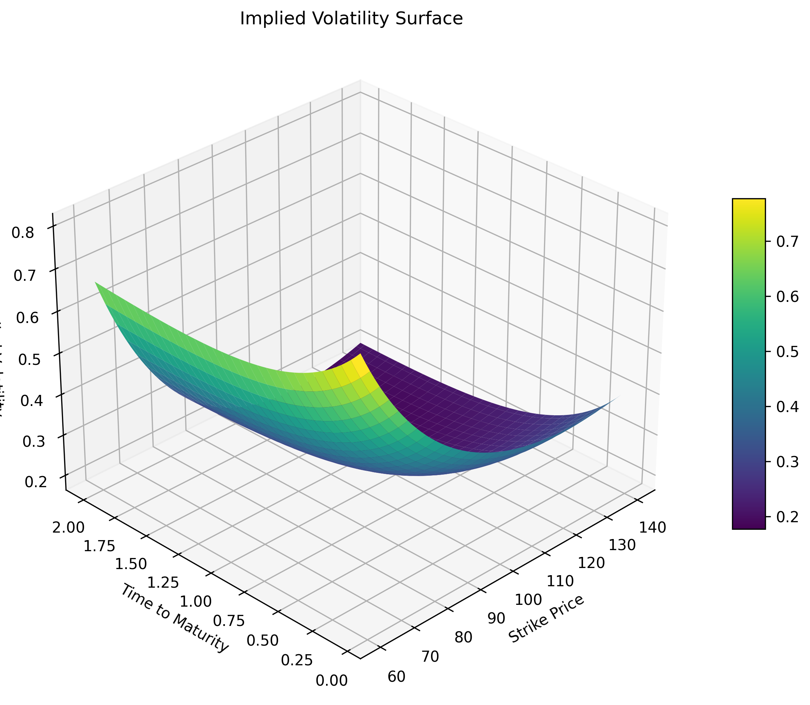

# Implied Volatility Surface (Black–Scholes)

This project constructs and visualizes an implied volatility surface using the Black–Scholes model.

> Built as part of a quantitative finance project exploring volatility modeling and option pricing.

I've recently gotten pretty interested in Quant finance and wanted to expand my horizons a bit, this is a very very simple implied volatility plotter, I wish to update this in the future to have more applications.

---

## Overview

The Black–Scholes model assumes constant volatility. However, real markets exhibit:

- Volatility **smile**
- Volatility **skew**
- **Term structure** of volatility

This project demonstrates how implied volatility varies across strike and maturity by:

1. Defining a synthetic volatility surface  
2. Pricing options using Black–Scholes  
3. Recovering implied volatility numerically  
4. Visualizing the resulting surface  

---

## Black–Scholes Model

The price of a European call option is:

$$
C(S, K, T, r, \sigma) = S \Phi(d_1) - K e^{-rT} \Phi(d_2)
$$

where:

$$
d_1 = \frac{\ln(S/K) + (r + \tfrac{1}{2}\sigma^2)T}{\sigma \sqrt{T}}, \quad
d_2 = d_1 - \sigma \sqrt{T}
$$

---

## Implied Volatility

Implied volatility is defined as the value of \( \sigma \) such that:

$$
C_{market} = C_{BS}(S, K, T, r, \sigma)
$$

Since no closed-form solution exists, it is computed numerically using a **bisection method**.

---

## Volatility Surface Construction

We define moneyness as:

$$
x = \log\left(\frac{K}{S}\right)
$$

The synthetic volatility surface is modeled as:

$$
\sigma(K, T) =
\sigma_0
+ a x^2
+ b x
+ c e^{-dT}
+ e x^2 T
$$

This captures:

- Smile (quadratic in moneyness)  
- Skew (linear in moneyness)  
- Term structure (time dependence)  

---

## Example Output



---

## Project Structure
implied-volatility-surface/
│
├── notebooks/
│ └── implied_vol_surface.ipynb
│
├── src/
│ ├── black_scholes.py
│ ├── implied_vol.py
│ └── surface.py
│
├── images/
│ └── surface.png
│
├── requirements.txt
└── README.md


---

## Installation

```bash
pip install -r requirements.txt


---
## Usage
jupyter notebook notebooks/implied_vol_surface.ipynb

---

## Key Features
- Black–Scholes option pricing implementation
- Numerical implied volatility solver (bisection method)
- Synthetic volatility surface generation
- 3D visualization of implied volatility

---

## Future Improvements
- Use real market option chain data
- Implement SVI / SABR calibration
- Add interactive Plotly visualization
- Build a live volatility surface tool